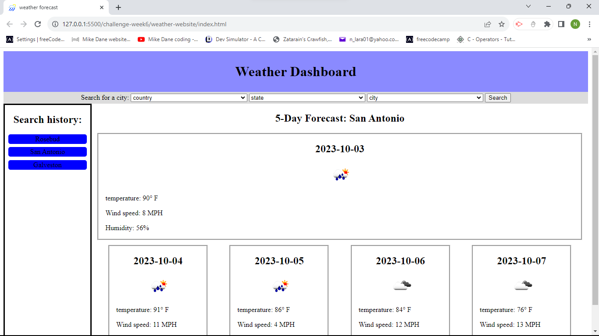

# weather-website

## Description

I created this website to help people around the globe accurately look up weather information. this project uses apis to get a location you want and give you the weather forecast for that area. this can help people be prepared for whatever weather may be coming their way as they go about their daily lifes.  

## Installation

N/A

## Usage

a user can click in the selects to choose a location then press search this will allow the user toget a list of the upcoming 5 days weatehr forcast and save the location into the histrory section on the right. once there is cities listed in the history the user can go into the history and click on a city to get the weather information for that city.

https://n-lara.github.io/weather-website/
## Credits

this was created by Noah Lara using theI also used the countrystatecity api (https://countrystatecity.in/). as well as using openweathermap api's geocoding api (https://openweathermap.org/api/geocoding-api) and their 5 day forecast api (https://openweathermap.org/forecast5).

## Features

* in this web application you can use the select menus to select a place in the world and then get the forecast for the next five days.

* you can also click on the left side where your saved history is to get forecast information for places you have previously looked up quickly